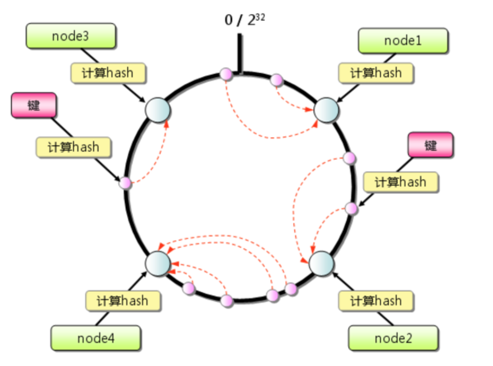

# 分布式面试题

## \# CAP理论，BASE理论，ACID理论
1. CAP理论: 在一个分布式系统（指互相连接并共享数据的节点的集合）中，当涉及读写操作时，只能保证一致性（Consistence）、可用性（Availability）、分区容错性（Partition Tolerance）三者中的两个，另外一个必须被牺牲。
2. BASE理论: BASE 是基本可用（Basically Available）、软状态（ Soft State）、最终一致性（ Eventual Consistency）三个短语的简写。BASE理论是对CAP中一致性和可用性权衡的结果，是基于CAP定力逐步演化而来的，是源于大规模互联网系统分布式实践的总结。其核心思想：无法做到强一致性，但是每一个应用都可以根据自身的业务特点，采用适当的方式来使系统达到最终一致性。
3. ACID理论: 原子性（Atomicity）、一致性（Consistency）、隔离性（Isolation）、持久性（Durability）。

## \# Zookeeper满足了CAP的哪些特性？
Zookeeper满足了C和P，牺牲了部分可用性。允许部分请求失败，leader选举时集群不可用。

## \# 什么是一致性Hash?

## \# 为什么使用消息队列？
解耦、削峰、异步

## \# 消息队列有什么优点和缺点？
- 优点：解耦、异步、削峰；
- 缺点：系统可用性降低、复杂度提高、一致性问题；

## \# ZooKeeper的数据结构以及怎么实现？
ZooKeeper数据模型的结构与Linux文件系统很像，整体上可以看作是一棵树，树的每个节点称做一个znode。
每一个znode默认能够存储1MB的数据，每个znode都可以通过其路径唯一标识。
分为持久节点临时节点、顺序节点三种类型的节点。

## \# Zookeeper 的角色？
- Leader 接受所有Follower的提案请求并统一协调发起提案的投票，负责与所有的Follower进行内部的数据交换(同步);
- Follower 直接为客户端服务并参与提案的投票，同时与Leader进行数据交换(同步);
- Observer 直接为客户端服务但并不参与提案的投票，同时也与Leader进行数据交换(同步);observer的作用是为了拓展系统，提高读取速度。

## \# Zookeeper 中 server 的状态
- LOOKING：竞选状态，当前Server不知道leader是谁，正在搜寻。
- LEADING：领导者状态，表明当前服务器角色是leader。
- FOLLOWING：随从状态，表明当前服务器角色是follower，同步leader状态，参与投票。
- OBSERVING，观察状态，表明当前服务器角色是observer，同步leader状态，不参与投票。

## \# Zookeeper 的选主流程？
1. 初始阶段，都会给自己投票。
2. 当接收到来自其他服务器的投票时，都需要将别人的投票和自己的投票进行pk，规则如下：
   1. 优先检查zxid。zxid比较大的服务器优先作为leader。
   2. 如果zxid相同的话，就比较sid，sid(myid)比较大的服务器作为leader。

## \# 负载均衡咋做的？
随机算法、轮询及加权轮询、最小连接及加权最小连接、哈希算法

## \# 怎么保证平滑发布？
下线待上线机器流量，发布机器，恢复流量

## \# 什么是ZAB协议？
- ZAB协议是专门为zookeeper实现分布式协调功能而设计。zookeeper主要是根据ZAB协议是实现分布式系统数据一致性
- ZooKeeper根据ZAB协议建立了主备模型完成zookeeper集群中数据的同步。这里所说的主备系统架构模型是指，在zookeeper集群中，只有一台leader负责处理外部客户端的事物请求(或写操作)，然后leader服务器将客户端的写操作数据同步到所有的follower节点中。
- ZAB的协议核心是在整个zookeeper集群中只有一个节点即Leader将客户端的写操作转化为事物(或提议proposal)。Leader节点再数据写完之后，将向所有的follower节点发送数据广播请求(或数据复制)，等待所有的follower节点反馈。在ZAB协议中，只要超过半数follower节点反馈OK，Leader节点就会向所有的follower服务器发送commit消息。即将leader节点上的数据同步到follower节点之上。
- Zab协议有两种模式，它们分别是恢复模式（选主）和广播模式（同步）
  - 崩溃恢复：一旦 Leader 服务器出现崩溃或者由于网络原因导致 Leader 服务器失去了与过半 Follower 的联系，那么就会进入崩溃恢复模式。
  - 消息广播：在zookeeper集群中，数据副本的传递策略就是采用消息广播模式。Zab协议中 Leader 等待 Follower 的ACK反馈消息是指只要半数以上的Follower成功反馈即可，不需要收到全部Follower反馈。

    