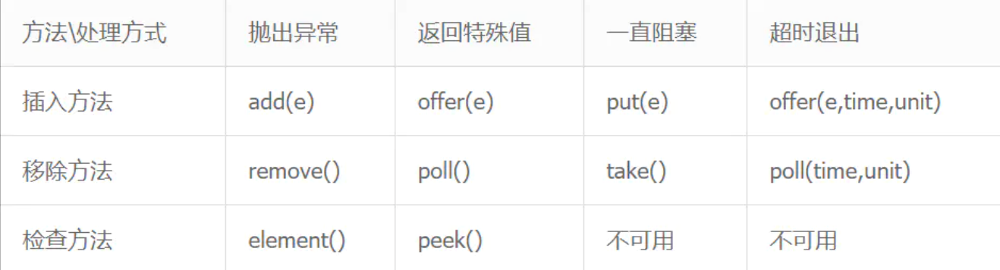

- [\# HashMap的底层数据结构？](#-hashmap的底层数据结构)
- [\# 什么对象能做为 HashMap 的 key?](#-什么对象能做为-hashmap-的-key)
- [\# HashMap 大小为什么是2的指数倍，对于扩容和非扩容情况都有哪些好处？](#-hashmap-大小为什么是2的指数倍对于扩容和非扩容情况都有哪些好处)
- [\# HashMap怎么扩容？怎么高效率的实现数据迁移？](#-hashmap怎么扩容怎么高效率的实现数据迁移)
- [\# HashMap, ConcurrentHashMap, HashTable比较](#-hashmap-concurrenthashmap-hashtable比较)
- [\# ConcurrentHashMap 原理？](#-concurrenthashmap-原理)
- [\# ConcurrentHashMap 在Java7和Java8中的区别？](#-concurrenthashmap-在java7和java8中的区别)
- [\# 为什么Java8的ConcurrentHashMap并发效率更好？](#-为什么java8的concurrenthashmap并发效率更好)
- [\# 什么情况下用HashMap，什么情况用ConcurrentHashMap？](#-什么情况下用hashmap什么情况用concurrenthashmap)
- [\# 关于 LinkedHashMap，以下代码输出的时候，key 为 2 的在第几位？](#-关于-linkedhashmap以下代码输出的时候key-为-2-的在第几位)
- [\# ArrayList的初始大小是多大？](#-arraylist的初始大小是多大)
- [\# Java中的队列](#-java中的队列)
- [\# 什么是阻塞队列？](#-什么是阻塞队列)
- [\# 阻塞队列不可用时的处理方法？](#-阻塞队列不可用时的处理方法)
- [\# AtomicInteger怎么实现原子修改的？](#-atomicinteger怎么实现原子修改的)

## \# HashMap的底层数据结构？
JDK1.7中HashMap的底层是由数组+单向链表这两种数据结构组合而成的，而在JDK1.8中HashMap是由数组+单向链表+红黑树三种数据结构组合而成的。
HashMap的本质就是一个复合结构，它其实就是有一个一个Node节点组成的一个Node数组。在初始化一个HashMap的时候，会规定这个数组容量为16（2的4次方），下标从0-15；数组的最大容量（扩容后）为2的30次方，而数组的扩容因素为0.75，即当每次数组实际用到的容量达到当前数组最大容量的0.75时，这个数组就会整体扩容一倍（乘以2）；而每个Node算出数组下标是根据该Node的hashcode（哈希值）除以16取余后的数字再进行一系类的计算得出，但是会出现计算出来的数值相同（即数组下标相同的Node节点出现），这时候就出现了所谓的哈希冲突。为了解决这一问题，引入了单向链表的操作，当算出数组下标相同的Node节点出现，就会以单向链表的数据结构形式，纵向的向下排，当向下排的Node节点达到8个节点。为了解决性能问题，（接下来是JDK1.8的内容）这时候引入了红黑树这个数据结构，程序会将之前的单向链表通过算法将其变成红黑树，而当这个红黑树里面的叶子节点数小于6的时候，程序又会将其由红黑树转换成单向链表结构。

## \# 什么对象能做为 HashMap 的 key?
一切对象都可以，对于自定义对象需要重写过hashCode和equals的对象，才能做为key。

## \# HashMap 大小为什么是2的指数倍，对于扩容和非扩容情况都有哪些好处？
- 对于新插入的数据或者待读取的数据，HashMap将Key的哈希值对数组长度取模，结果作为该Entry在数组中的index。在计算机中，取模的代价远高于位操作的代价，因此HashMap要求数组的长度必须为2的N次方。此时将Key的哈希值对2^N-1进行与运算，其效果即与取模等效；
- 为了使n-1的二进制低位全是1，使hash&(n-1)散列更均匀；
- 可以根据对最高位进行检测的结果来决定是否移位，从而可以优化性能，不用每一个元素都进行移位，因为为0说明刚好在移位完之后的位置，为1说明需要移动；

## \# HashMap怎么扩容？怎么高效率的实现数据迁移？
当hashmap中的元素个数超过`数组大小*loadFactor`时，就会进行数组扩容。
避免rehash实现高效数据迁移。

## \# HashMap, ConcurrentHashMap, HashTable比较
- HashMap是非线程安全的，ConcurrentHashMap和HashTable是线程安全的；
- HashMap的键和值都允许有null存在，而ConcurrentHashMap和HashTable则都不行；
- 因为线程安全、哈希效率的问题，HashMap效率比HashTable的要高；ConcurrentHashMap对整个桶数组进行了分割分段，然后在每一个分段上都用Lock进行保护，相对于HashTable的synchronized的粒度更精细了一些，并发性能更好

## \# ConcurrentHashMap 原理？
ConcurrentHashMap可以做到读取数据不加锁，并且其内部的结构可以让其在进行写操作的时候能够将锁的粒度保持地尽量地小，允许多个修改操作并发进行，其关键在于使用了锁分段技术。它使用了多个锁来控制对hash表的不同部分进行的修改。

## \# ConcurrentHashMap 在Java7和Java8中的区别？
- Java8的实现降低锁的粒度，Java7锁的粒度是基于Segment的，包含多个HashEntry，而Java8锁的粒度就是HashEntry（首节点）;
- Java8版本的数据结构变得更加简单，使得操作也更加清晰流畅，对于HashEntry为 null 的情况使用CAS写入，不为 null 使用synchronized来进行同步，所以不需要分段锁的概念，也就不需要Segment这种数据结构了
- Java8使用红黑树来优化链表，基于长度很长的链表的遍历是一个很漫长的过程，而红黑树的遍历效率是很快的，代替一定阈值的链表;

## \# 为什么Java8的ConcurrentHashMap并发效率更好？
Java 8 中，锁粒度更细，理想情况下 table 数组元素的个数（也就是数组长度）就是其支持并发的最大个数，所以并发度比之前有提高。

## \# 什么情况下用HashMap，什么情况用ConcurrentHashMap？
在多线程并发向HashMap中put数据时，就需要把HashMap换成ConcurrentHashMap。

## \# 关于 LinkedHashMap，以下代码输出的时候，key 为 2 的在第几位？
```java
LinkedHashMap<Integer,Integer> m = new LinkedHashMap(10, 0.75f, true);
m.put(1,11);
m.put(2,22);
m.put(9,33);
m.put(8,44);
m.get(2);
for(Map.Entry<Integer,Integer> e : m.entrySet()){
   System.out.println(e.getKey());
}
```
第一位，accessOrder=true时所有的Entry按照访问的顺序排列；

## \# ArrayList的初始大小是多大？
数组初始容量是10，列表实际大小是0。

## \# Java中的队列
- 没有实现阻塞接口：
  - 实现java.util.Queue的LinkList；
  - 实现java.util.AbstractQueue接口内置的不阻塞队列： PriorityQueue 和 ConcurrentLinkedQueue；

- 实现阻塞接口的，java.util.concurrent 中加入了 BlockingQueue 接口和五个阻塞队列类。它实质上就是一种带有一点扭曲的 FIFO 数据结构。不是立即从队列中添加或者删除元素，线程执行操作阻塞，直到有空间或者元素可用
  - ArrayBlockingQueue ：一个由数组支持的有界队列。
  - LinkedBlockingQueue ：一个由链接节点支持的可选有界队列。
  - PriorityBlockingQueue ：一个由优先级堆支持的无界优先级队列。
  - DelayQueue ：一个由优先级堆支持的、基于时间的调度队列。
  - SynchronousQueue ：一个利用 BlockingQueue 接口的简单聚集（rendezvous）机制，不存储元素。

## \# 什么是阻塞队列？
- 在队列为空时，获取元素的线程会等待队列变为非空。

- 当队列满时，存储元素的线程会等待队列可用。

## \# 阻塞队列不可用时的处理方法？

1. 抛出异常：是指当阻塞队列满时候，再往队列里插入元素，会抛出 IllegalStateException("Queue full") 异常。当队列为空时，从队列里获取元素时会抛出 NoSuchElementException 异常 。
2. 返回特殊值：插入方法会返回是否成功，成功则返回 true。移除方法，则是从队列里拿出一个元素，如果没有则返回 null
3. 一直阻塞：当阻塞队列满时，如果生产者线程往队列里 put 元素，队列会一直阻塞生产者线程，直到拿到数据，或者响应中断退出。当队列空时，消费者线程试图从队列里 take 元素，队列也会阻塞消费者线程，直到队列可用。
4. 超时退出：当阻塞队列满时，队列会阻塞生产者线程一段时间，如果超过一定的时间，生产者线程就会退出。

## \# AtomicInteger怎么实现原子修改的？
AtomicInteger是通过循环 CAS 的方式来实现。