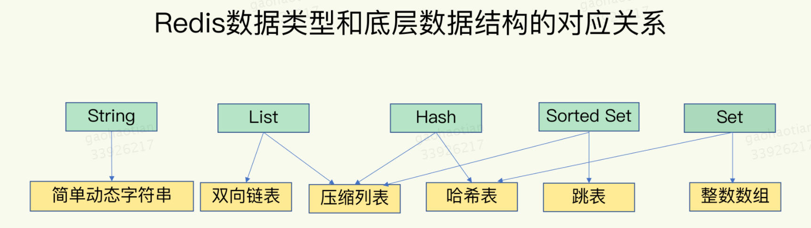

- [\# 缓存穿透、缓存雪崩、缓存击穿是什么？怎么解决？](#-缓存穿透缓存雪崩缓存击穿是什么怎么解决)
- [\# Redis 的数据结构是什么样的？rehash过程？](#-redis-的数据结构是什么样的rehash过程)
- [\# Redis 的底层数据结构？](#-redis-的底层数据结构)
- [\# Redis 是单线程还是多线程？](#-redis-是单线程还是多线程)
- [\# Redis 怎样保证高性能的？](#-redis-怎样保证高性能的)
- [\# Redis 的 IO 模型](#-redis-的-io-模型)
- [\# Redis 真的不会阻塞吗？](#-redis-真的不会阻塞吗)
- [\# select，poll，epoll的区别？](#-selectpollepoll的区别)
- [\# epoll 的实现？](#-epoll-的实现)
- [\# epoll 什么时候比select慢？](#-epoll-什么时候比select慢)
- [\# 缓存淘汰策略有哪些，设置超时时间的值是怎么清除的？](#-缓存淘汰策略有哪些设置超时时间的值是怎么清除的)
- [\# 缓存的持久化策略](#-缓存的持久化策略)
- [\# 如何保证redis高可用？](#-如何保证redis高可用)
- [\# Redis 主从复制过程？](#-redis-主从复制过程)
- [\# Redis 哨兵机制？](#-redis-哨兵机制)
- [\# Redis 哨兵机制的工作原理？](#-redis-哨兵机制的工作原理)
- [\# 故障转移过程](#-故障转移过程)
- [\# 选举 Leader sentinel 的过程](#-选举-leader-sentinel-的过程)
- [\# 数据结构实现？](#-数据结构实现)
- [\# Redis如何实现分布式锁？](#-redis如何实现分布式锁)
- [\# Redis 集群方案应该怎么做？都有哪些方案？](#-redis-集群方案应该怎么做都有哪些方案)
- [\# Redis 的脑裂问题](#-redis-的脑裂问题)
- [\# Redis Cluster 的 Slot 迁移](#-redis-cluster-的-slot-迁移)
- [\# Redis 有哪些适合的场景？](#-redis-有哪些适合的场景)

## \# 缓存穿透、缓存雪崩、缓存击穿是什么？怎么解决？
- 缓存穿透：缓存穿透是指查询一个一定不存在的数据，由于缓存是不命中时被动写的，并且出于容错考虑，如果从存储层查不到数据则不写入缓存，这将导致这个不存在的数据每次请求都要到存储层去查询。解决方法：布隆过滤器/缓存空值；
- 缓存雪崩：缓存雪崩是指在我们设置缓存时采用了相同的过期时间，导致缓存在某一时刻同时失效，请求全部转发到DB，DB瞬时压力过重雪崩。解决方案：设计时避免、在原有的失效时间基础上增加一个随机值；
- 缓存击穿：缓存在某个时间点过期的时候，恰好在这个时间点对这个Key有大量的并发请求过来，这些请求发现缓存过期一般都会从后端DB加载数据并回设到缓存，这个时候大并发的请求可能会瞬间把后端DB压垮。解决方案：限流/加锁/异步更新；

## \# Redis 的数据结构是什么样的？rehash过程？
Redis使用了一个哈希表来保存所有键值对。
一个哈希表，其实就是一个数组，数组的每个元素称为一个哈希桶。所以，我们常说，一个哈希表是由多个哈希桶组成的，每个哈希桶中保存了键值对数据。
哈希桶中的元素保存的并不是值本身，而是指向具体值的指针。这也就是说，不管值是String，还是集合类型，哈希桶中的元素都是指向它们的指针。
为了使rehash操作更高效，Redis默认使用了两个全局哈希表：哈希表1和哈希表2。一开始，当你刚插入数据时，默认使用哈希表1，此时的哈希表2并没有被分配空间。随着数据逐步增多，Redis开始执行rehash，这个过程分为三步：
1. 给哈希表2分配更大的空间，例如是当前哈希表1大小的两倍；
2. 把哈希表1中的数据重新映射并拷贝到哈希表2中；
3. 释放哈希表1的空间；
到此，我们就可以从哈希表1切换到哈希表2，用增大的哈希表2保存更多数据，而原来的哈希表1留作下一次rehash扩容备用。
为了避免一次性把哈希表1中的数据都迁移完，造成Redis线程阻塞，无法服务其他请求的问题，Redis采用了渐进式rehash。简单来说就是在第二步拷贝数据时，Redis仍然正常处理客户端请求，每处理一个请求时，从哈希表1中的第一个索引位置开始，顺带着将这个索引位置上的所有entries拷贝到哈希表2中；等处理下一个请求时，再顺带拷贝哈希表1中的下一个索引位置的entries。

## \# Redis 的底层数据结构？

1. 简单动态字符串
2. 整数数组
3. 双向链表
4. 哈希表
5. 压缩列表：压缩列表实际上类似于一个数组，数组中的每一个元素都对应保存一个数据。和数组不同的是，压缩列表在表头有三个字段zlbytes、zltail和zllen，分别表示列表长度、列表尾的偏移量和列表中的entry个数；压缩列表在表尾还有一个zlend，表示列表结束。在压缩列表中，如果我们要查找定位第一个元素和最后一个元素，可以通过表头三个字段的长度直接定位，复杂度是O(1)。而查找其他元素时，就没有这么高效了，只能逐个查找，此时的复杂度就是O(N)了。
6. 跳表：跳表在链表的基础上，增加了多级索引，通过索引位置的几个跳转，实现数据的快速定位。

## \# Redis 是单线程还是多线程？
Redis的网络IO和键值对读写是由一个线程来完成的，这也是Redis对外提供键值存储服务的主要流程。但Redis的其他功能，比如持久化、异步删除、集群数据同步等，其实是由额外的线程执行的。
主流程单线程可以避免线程上下文的切换，避免共享资源的并发访问控制问题。

## \# Redis 怎样保证高性能的？
- Redis的大部分操作在内存上完成，再加上它采用了高效的数据结构，例如哈希表和跳表，这是它实现高性能的一个重要原因；
- Redis采用了多路复用机制，使其在网络IO操作中能并发处理大量的客户端请求，实现高吞吐率；

## \# Redis 的 IO 模型

基于多路复用的高性能I/O模型。
1. epoll一旦临听到FD上有请求到达，就会触发相应的事件，并放进一个事件队列中；
2. Redis单线程对事件队列进行处理即可，无需一直轮询是否有请求发生，避免CPU资源浪费；

## \# Redis 真的不会阻塞吗？
1. 集合全量查询和聚合操作
2. 大key删除操作(可异步)
3. 清空数据库(可异步)
4. AOF日志同步写(可异步)
5. 加载RDB文件

## \# select，poll，epoll的区别？
- select：仅仅知道有I/O事件发生了，却并不知道是哪那几个流（可能有一个，多个，甚至全部），只能无差别轮询所有流，找出能读出数据，或者写入数据的流，对他们进行操作。所以select具有O(n)的无差别轮询复杂度，同时处理的流越多，无差别轮询时间就越长。select存在的问题：1. 每次调用select，都需要把fd_set集合从用户态拷贝到内核态，如果fd_set集合很大时，那这个开销也很大；2. 同时每次调用select都需要在内核遍历传递进来的所有fd_set，如果fd_set集合很大时，那这个开销也很大；3. 为了减少数据拷贝带来的性能损坏，内核对被监控的fd_set集合大小做了限制，并且这个是通过宏控制的，大小不可改变(限制为1024)；4.select返回的是含有整个句柄的数组，应用程序需要遍历整个数组才能发现哪些句柄发生了事件；5.select的触发方式是水平触发，应用程序如果没有完成对一个已经就绪的文件描述符进行IO操作，那么之后每次select调用还是会将这些文件描述符通知进程。
- poll：poll本质上和select没有区别，它将用户传入的数组拷贝到内核空间，然后查询每个fd对应的设备状态， 但是它没有最大连接数的限制，原因是它是基于链表来存储的。
- epoll：可以理解为event poll，不同于忙轮询和无差别轮询，epoll会把哪个流发生了怎样的I/O事件通知我们。所以我们说epoll实际上是事件驱动（每个事件关联上fd）的，此时我们对这些流的操作都是有意义的。因此复杂度降低到了O(1)。获取事件的时候，它无须遍历整个被侦听的描述符集，只要遍历那些被内核IO事件异步唤醒而加入Ready队列的描述符集合就行了。epoll 使用了“共享内存”，这个内存拷贝也省略了。

## \# epoll 的实现？
当某一进程调用epoll_create方法时，Linux内核会创建一个eventpoll结构体，这个结构体中有两个成员与epoll的使用方式密切相关，一个是存储所有添加到epoll中需要监控的事件的树的根节点，另一个是将要通过epoll_wait返回给用户的满足条件的事件的链表的头结点。
在epoll中，对于每一个事件，都会建立一个epitem结构体。
每一个epoll对象都有一个独立的eventpoll结构体，用于存放通过epoll_ctl方法向epoll对象中添加进来的事件。这些事件都会挂载在红黑树中，如此，重复添加的事件就可以通过红黑树而高效的识别出来(红黑树的插入时间效率是lgn，其中n为树的高度)。
而所有添加到epoll中的事件都会与设备(网卡)驱动程序建立回调关系，也就是说，当相应的事件发生时会调用这个回调方法 。这个回调方法在内核中叫ep_poll_callback，它会将发生的事件epitem添加到rdlist双链表中。
当调用epoll_wait检查是否有事件发生时，只需要检查eventpoll对象中的rdlist双链表中是否有epitem元素即可。如果rdlist不为空，则把发生的事件复制到用户态，同时将事件数量返回给用户。

## \# epoll 什么时候比select慢？
少连接，高并发。连接少意味着不会超过select 1024的上限，高并发意味着一次wait每一个连接都会来数据。把扫描有事件连接时的O(n)复杂度降至位O(1)。

## \# 缓存淘汰策略有哪些，设置超时时间的值是怎么清除的？
1. noeviction：不进行数据淘汰；
2. allkeys-lru：使用LRU算法在所有数据中进行筛选；
3. allkeys-random：从所有键值对中随机选择并删除数据；
4. allkeys-lfu：使用LFU算法在所有数据中进行筛选；
5. volatile-random：在设置了过期时间的键值对中，进行随机删除；
6. volatile-ttl：在筛选时，会针对设置了过期时间的键值对，根据过期时间的先后进行删除，越早过期的越先被删除；
7. volatile-lru：使用LRU算法筛选设置了过期时间的键值对；
8. volatile-lfu：使用LFU算法筛选设置了过期时间的键值对；
如果一个键值对被删除策略选中了，即使它的过期时间还没到，也需要被删除。当然，如果它的过期时间到了但未被策略选中，同样也会被删除。

## \# 缓存的持久化策略
- AOF(Append Only File)日志：Redis是先执行命令，把数据写入内存，然后才记录日志。它是在命令执行后才记录日志，所以不会阻塞当前的写操作。如果刚执行完一个命令，还没有来得及记日志就宕机了，那么这个命令和相应的数据就有丢失的风险。因为 AOF 日志也是在主线程中执行的，如果在把日志文件写入磁盘时，磁盘写压力大，就会导致写盘很慢，进而导致后续的操作也无法执行了。AOF日志的三种写回策略，分别是Always、Everysec和No。
- RDB(Redis DataBase)快照：指内存中的数据在某一个时刻的状态记录。Redis的数据都在内存中，为了提供所有数据的可靠性保证，它执行的是全量快照。可以通过bgsave命令来执行全量快照，这既提供了数据的可靠性保证，也避免了对Redis的性能影响。Redis会借助操作系统提供的写时复制技术（Copy-On-Write, COW），在执行快照的同时，正常处理写操作。如果主线程对这些数据也都是读操作，那么，主线程和bgsave子进程相互不影响。但是，如果主线程要修改一块数据，那么，这块数据就会被复制一份，生成该数据的副本。然后，bgsave子进程会把这个副本数据写入RDB文件，而在这个过程中，主线程仍然可以直接修改原来的数据。
- 混合使用AOF日志和内存快照：内存快照以一定的频率执行，在两次快照之间，使用AOF日志记录这期间的所有命令操作。

## \# 如何保证redis高可用？
- 数据尽量少丢失：AOF 和 RDB；
- 服务尽量少中断：增加副本冗余量，将一份数据同时保存在多个实例上。
  1. Redis 提供了主从库模式，以保证数据副本的一致，主从库之间采用的是读写分离的方式。全量复制、基于长连接的命令传播，以及增量复制；
  2. 哨兵机制：哨兵主要负责的就是三个任务：监控、选主（选择主库）和通知。

## \# Redis 主从复制过程？
当一个从数据库启动时，会向主数据库发送sync命令，
1. 主数据库接收到sync命令后会开始在后台保存快照（执行rdb操作），并将保存期间接收到的命令缓存起来
2. 当快照完成后，redis会将快照文件和所有缓存的命令发送给从数据库。
3. 从数据库收到后，会载入快照文件并执行收到的缓存的命令。

## \# Redis 哨兵机制？
1.  Sentinel 会不断的检查 主服务器 和 从服务器 是否正常运行。
2. 当被监控的某个 Redis 服务器出现问题，Sentinel 通过 API 脚本 向 管理员 或者其他的 应用程序 发送通知。
3. 当 主节点 不能正常工作时，Sentinel 会开始一次 自动的 故障转移操作，它会将与 失效主节点 是 主从关系 的其中一个 从节点 升级为新的 主节点，并且将其他的 从节点 指向 新的主节点。

## \# Redis 哨兵机制的工作原理？
1. 每个 Sentinel 以每秒钟一次的频率，向它所知的主服务器、从服务器以及其他 Sentinel 实例 发送一个 PING 命令。
2. 如果一个实例距离最后一次有效回复 PING 命令的时间超过 down-after-milliseconds 所指定的值，那么这个实例会被 Sentinel 标记为主观下线。
3. 如果一个主服务器被标记为主观下线，那么正在监视这个主服务器的所有 Sentinel 节点，要以每秒一次的频率确认主服务器的确进入了主观下线状态。
4. 如果一个主服务器被标记 主观下线，并且有足够数量的 Sentinel（至少要达到 配置文件 指定的数量）在指定的时间范围内同意这一判断，那么这个主服务器被标记为客观下线。
5. 在一般情况下， 每个 Sentinel 会以每 10 秒一次的频率，向它已知的所有 主服务器 和 从服务器 发送 INFO 命令。当一个 主服务器 被 Sentinel 标记为客观下线时，Sentinel 向下线主服务器的所有从服务器发送 INFO 命令的频率，会从 10 秒一次改为每秒一次。
6. Sentinel 和其他 Sentinel 协商主节点的状态，如果主节点处于客观下线状态，则投票自动选出新的主节点。将剩余的从节点指向新的主节点进行数据复制。
7. 当没有足够数量的 Sentinel 同意主服务器下线时， 主服务器的客观下线状态就会被移除。当 主服务器重新向 Sentinel 的 PING 命令返回有效回复时，主服务器的主观下线状态就会被移除。

## \# 故障转移过程
1. 删除处于下线状态的从服务；
2. 删除最近5秒没有回复过领头sentinel info信息的从服务；
3. 删除与已下线的主服务断开连接时间超过 down-after-milliseconds*10毫秒的从服务，这样就能保留从的数据比较新（没有过早的与主断开连接）；
4. 领头sentinel从剩下的从列表中选择优先级高的；
5. 如果优先级一样，选择偏移量最大的（偏移量大说明复制的数据比较新）；
6. 如果偏移量一样，选择运行id最小的从服务；

## \# 选举 Leader sentinel 的过程
一个redis服务被判断为客观下线时，多个监视该服务的sentinel协商，选举一个领头sentinel，对该redis服务进行故障转移操作。选举领头sentinel遵循以下规则：
1. 所有的sentinel都有公平被选举成 Leader 的资格。
2. 所有的sentinel都有且只有一次将某个sentinel选举成 Leader 的机会（在一轮选举中），一旦选举某个sentinel为 Leader，不能更改。
3. sentinel设置 Leader 是先到先得，一旦当前sentinel设置了 Leader ，以后要求设置sentinel为 Leader 请求都会被拒绝。
4. 每个发现服务客观下线的sentinel，都会要求其他sentinel将自己设置成领头。
5. 当一个sentinel（源sentinel）向另一个sentinel（目sentinel）发送is-master-down-by-addr ip port current_epoch runid命令的时候，runid参数不是*，而是sentinel运行id，就表示源sentinel要求目标sentinel选举其为 Leader 。
6. 源sentinel会检查目标sentinel对其要求设置成 Leader 的回复，如果回复的leader_runid和leader_epoch为源sentinel，表示目标sentinel同意将源sentinel设置成 Leader 。
7. 如果某个sentinel被半数以上的sentinel设置成 Leader ，那么该sentinel既为 Leader 。
8. 如果在限定时间内，没有选举出 Leader ，暂定一段时间，再选举。

## \# 数据结构实现？
1. zset：zset底层的存储结构包括ziplist或skiplist，在同时满足元素数量小于128个且所有元素的长度小于64字节的时候使用ziplist，其他时候使用skiplist。当ziplist作为zset的底层存储结构时候，每个集合元素使用两个紧挨在一起的压缩列表节点来保存，第一个节点保存元素的成员，第二个元素保存元素的分值。当skiplist作为zset的底层存储结构的时候，使用skiplist按序保存元素及分值，使用dict来保存元素和分值的映射关系。
2. set：set的底层存储intset和hashtable是存在编码转换的，使用intset存储必须满足下面两个条件，否则使用hashtable，条件如下：结合对象保存的所有元素都是整数值，集合对象保存的元素数量不超过512个；intset内部其实是一个数组（int8_t coentents[]数组），而且存储数据的时候是有序的。
3. list：当链表entry数据超过512、或单个value 长度超过64，底层就会转化成linkedlist编码；linkedlist是标准的双向链表，Node节点包含prev和next指针，可以进行双向遍历；还保存了 head 和 tail 两个指针，因此，对链表的表头和表尾进行插入的复杂度都为 O(1)，这是高效实现 LPUSH 、 RPOP、 RPOPLPUSH 等命令的关键。
4. hash：哈希对象使用ziplist需要满足两个条件：一是所有键值对的键和值的字符串长度都小于64字节；二是键值对数量小于512个；不满足任意一个都使用hashtable。

## \# Redis如何实现分布式锁？
1. 客户端获取当前时间；
2. 客户端按顺序依次向N个Redis实例执行加锁操作；如果客户端在和一个Redis实例请求加锁时，一直到超时都没有成功，那么此时，客户端会和下一个Redis实例继续请求加锁。加锁操作的超时时间需要远远地小于锁的有效时间，一般也就是设置为几十毫秒；
3. 一旦客户端完成了和所有Redis实例的加锁操作，客户端就要计算整个加锁过程的总耗时；客户端从超过半数（大于等于 N/2+1）的Redis实例上成功获取到了锁，且客户端获取锁的总耗时没有超过锁的有效时间，才能认为是加锁成功；
4. 在满足了这两个条件后，我们需要重新计算这把锁的有效时间，计算的结果是锁的最初有效时间减去客户端为获取锁的总耗时。如果锁的有效时间已经来不及完成共享数据的操作了，我们可以释放锁，以免出现还没完成数据操作，锁就过期了的情况。当然，如果客户端在和所有实例执行完加锁操作后，没能同时满足这两个条件，那么，客户端向所有Redis节点发起释放锁的操作。
5. 在Redlock算法中，释放锁的操作和在单实例上释放锁的操作一样，只要执行释放锁的Lua脚本就可以了。这样一来，只要N个Redis实例中的半数以上实例能正常工作，就能保证分布式锁的正常工作了。

## \# Redis 集群方案应该怎么做？都有哪些方案？
1. 基于客户端sharding的Redis Sharding：客户端给一个实例发送数据读写操作时，这个实例上并没有相应的数据，客户端要再给一个新实例发送操作命令。
2. 基于服务端sharding的Redis Cluster：此方案采用哈希槽（Hash Slot，接下来我会直接称之为 Slot），来处理数据和实例之间的映射关系。一个切片集群共有 16384 个哈希槽，这些哈希槽类似于数据分区，每个键值对都会根据它的 key，被映射到一个哈希槽中。首先根据键值对的 key，按照CRC16 算法计算一个 16 bit 的值；然后，再用这个 16bit 值对 16384 取模，得到 0~16383 范围内的模数，每个模数代表一个相应编号的哈希槽。Redis 实例会把自己的哈希槽信息发给和它相连接的其它实例，来完成哈希槽分配信息的扩散。当实例之间相互连接后，每个实例就有所有哈希槽的映射关系了。客户端收到哈希槽信息后，会把哈希槽信息缓存在本地。当客户端请求键值对时，会先计算键所对应的哈希槽，然后就可以给相应的实例发送请求了。
3. 基于代理的集群方案

## \# Redis 的脑裂问题
原主库并没有真的发生故障（例如主库进程挂掉）。主库是由于某些原因无法处理请求，也没有响应哨兵的心跳，被哨兵错误地判断为客观下线的。结果，在被判断下线之后，原主库又重新开始处理请求了，而此时，哨兵还没有完成主从切换，客户端仍然可以和原主库通信，客户端发送的写操作就会在原主库上写入数据了。
主从切换后，从库一旦升级为新主库，哨兵就会让原主库执行slave of命令，和新主库重新进行全量同步。而在全量同步执行的最后阶段，原主库需要清空本地的数据，加载新主库发送的RDB文件，这样一来，原主库在主从切换期间保存的新写数据就丢失了。
解决方案：
- min-slaves-to-write：这个配置项设置了主库能进行数据同步的最少从库数量；
- min-slaves-max-lag：这个配置项设置了主从库间进行数据复制时，从库给主库发送ACK消息的最大延迟（以秒为单位）。

## \# Redis Cluster 的 Slot 迁移
1. 对目标节点发送cluster setslot import 命令，让目标节点做好准备接收迁移准备。
2. 对源节点发送cluster setslot migrating命令，让源节点做好准备迁移准备。
3. 对源节点发送cluster getkeysinslot <slot> <count>命令，获取对应slot的最多count个属于slot的key名。
4. 对于步骤3中获取的key，向源节点发送命令migrate <target ip> <target port> <key_name> 0 <timeout> 命令，将被选中的键原子地从源节点迁移到目标节点。
5. 重复上述3，4步骤，直到所有key都迁移成功
当在迁移过程中，如果被访问的slot，可能会有部分key存在在源节点，有部分在目标节点中。
1. 当客户端发送请求到源节点的时候，源节点会查看对应的key是否还在本节点，如果存在，则直接执行命令返回给客户。如果不存在，则会给客户端返回一个ASK错误，指引客户端往正在导入的目标slot去请求对应的key。客户端可以通过返回的ASK错误中的目标节点进行对应KEY的请求。
2. 当客户端发送请求到目标节点时。
3. 如果客户端请求时，带上ASKING标识，由目标节点会执行对应KEY的查询。正常情况下，如果是通过查询源slot，获取ASK错误之后，再到目标节点进行查询的时候，需要带上ASKING标识。
4. 如果客户端请求时，未带上ASKING标识，原由上，对应的slot还属于源节点，则目标节点会拒绝执行KEY查询，会返回一个MOVED错误给客户端，告诉客户端对应的KEY的slot属于源节点。正常情况下，如果第一次请求KEY到了正在迁移的目标节点，则会收到MOVED错误。

## \# Redis 有哪些适合的场景？
- 热点数据的缓存
由于redis访问速度块、支持的数据类型比较丰富，所以redis很适合用来存储热点数据，另外结合expire，我们可以设置过期时间然后再进行缓存更新操作，这个功能最为常见，我们几乎所有的项目都有所运用。
- 限时业务的运用
redis中可以使用expire命令设置一个键的生存时间，到时间后redis会删除它。利用这一特性可以运用在限时的优惠活动信息、手机验证码等业务场景。
- 计数器相关问题
redis由于incrby命令可以实现原子性的递增，所以可以运用于高并发的秒杀活动、分布式序列号的生成、具体业务还体现在比如限制一个手机号发多少条短信、一个接口一分钟限制多少请求、一个接口一天限制调用多少次等等。
- 排行榜相关问题
关系型数据库在排行榜方面查询速度普遍偏慢，所以可以借助redis的SortedSet进行热点数据的排序。
- 分布式锁
这个主要利用redis的setnx命令进行，setnx："set if not exists"就是如果不存在则成功设置缓存同时返回1，否则返回0 ，这个特性在俞你奔远方的后台中有所运用，因为我们服务器是集群的，定时任务可能在两台机器上都会运行，所以在定时任务中首先 通过setnx设置一个lock，如果成功设置则执行，如果没有成功设置，则表明该定时任务已执行。 当然结合具体业务，我们可以给这个lock加一个过期时间，比如说30分钟执行一次的定时任务，那么这个过期时间设置为小于30分钟的一个时间 就可以，这个与定时任务的周期以及定时任务执行消耗时间相关。