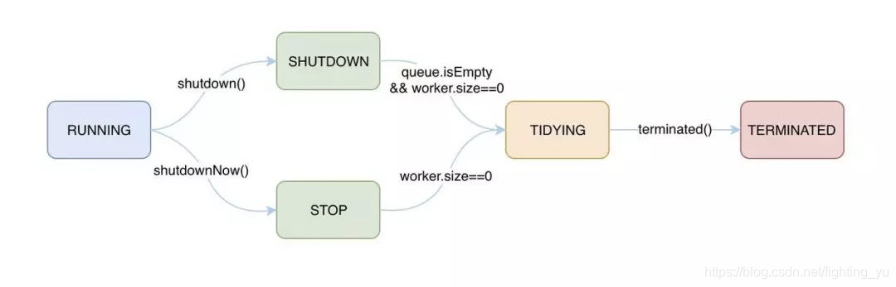

# 多线程面试题

## \# wait,sleep分别是谁的方法，区别？
- sleep() 方法是线程类（Thread）的静态方法，让调用线程进入睡眠状态，让出执行机会给其他线程，等到休眠时间结束后，线程进入就绪状态和其他线程一起竞争cpu的执行时间。因为sleep() 是static静态的方法，他不能改变对象的机锁，当一个synchronized块中调用了sleep() 方法，线程虽然进入休眠，但是对象的机锁没有被释放，其他线程依然无法访问这个对象。
- wait()是Object类的方法，当一个线程执行到wait方法时，它就进入到一个和该对象相关的等待池，同时释放对象的机锁，使得其他线程能够访问，可以通过notify，notifyAll方法来唤醒等待的线程。
- wait，notify和notifyAll只能在同步控制方法或者同步控制块里面使用，而sleep可以在任何地方使用。
- sleep必须捕获异常，而wait，notify和notifyAll不需要捕获异常。

## \# CountDownLatch 的 await 方法是否安全，怎么改造？
执行countdown的某个子线程可能会因为某些原因无法执行countdown，这样就会导致await线程一直阻塞下去。在线程池中多次调用await方法，因为await方法会阻塞一段时间，有可能导致线程池可用线程被大量阻塞。
最好不要用CountDownLatch实例的await()，归避长时间阻塞线程的风险，任何多线程应用程序都有死锁风险，改用CountDownLatch实例的await(long timeout, TimeUnit unit)，设定超时时间，如果超时，将返回false,这样我们得知超时后，可以做异常处理，而await()是void类型，没有返回值，我们无法得知超时信息。

## \# 线程状态？

## \# 线程池原理，整个流程描述？

8. 线程池包含一个线程集合workerSet和一个阻塞队列workQueue。

1. 提交任务后，线程池先判断线程数是否达到了核心线程数（corePoolSize）。如果未达到线程数，则创建核心线程处理任务；否则，就执行下一步；
2. 接着线程池判断任务队列是否满了。如果没满，则将任务添加到任务队列中；否则，执行下一步；
3. 接着因为任务队列满了，线程池就判断线程数是否达到了最大线程数。如果未达到，则创建非核心线程处理任务；否则，就执行饱和策略，默认会抛出RejectedExecutionException异常。

## \# 线程池有哪些核心参数，都有什么作用？

10. 1. corePoolSize: 规定线程池有几个线程(worker)在运行。
2. maximumPoolSize: 当workQueue满了,不能添加任务的时候，这个参数才会生效。规定线程池最多只能有多少个线程(worker)在执行。
3. keepAliveTime: 超出corePoolSize大小的那些线程的生存时间,这些线程如果长时间没有执行任务并且超过了keepAliveTime设定的时间，就会消亡。
4. unit: 生存时间对于的单位
5. workQueue: 存放任务的队列
6. threadFactory: 创建线程的工厂
7. handler: 当workQueue已经满了，并且线程池线程数已经达到maximumPoolSize，将执行拒绝策略。

## \# 线程池饱和策略

12. 1. Abort策略：默认策略，新任务提交时直接抛出未检查的异常RejectedExecutionException，该异常可由调用者捕获。
2. CallerRuns策略：为调节机制，既不抛弃任务也不抛出异常，而是将某些任务回退到调用者。不会在线程池的线程中执行新的任务，而是在调用exector的线程中运行新的任务。
3. Discard策略：新提交的任务被抛弃。
4. DiscardOldest策略：队列的是“队头”的任务，然后尝试提交新的任务。

## \# 线程池的队列

14. 1. 直接提交。工作队列的默认选项是 SynchronousQueue，它将任务直接提交给线程而不保持它们。在此，如果不存在可用于立即运行任务的线程，则试图把任务加入队列将失败，因此会构造一个新的线程。此策略可以避免在处理可能具有内部依赖性的请求集时出现锁。直接提交通常要求无界 maximumPoolSizes 以避免拒绝新提交的任务。当命令以超过队列所能处理的平均数连续到达时，此策略允许无界线程具有增长的可能性。
2. 无界队列。使用无界队列（例如，不具有预定义容量的 LinkedBlockingQueue）将导致在所有 corePoolSize 线程都忙时新任务在队列中等待。这样，创建的线程就不会超过 corePoolSize。（因此，maximumPoolSize的值也就无效了。）当每个任务完全独立于其他任务，即任务执行互不影响时，适合于使用无界队列；例如，在 Web页服务器中。这种排队可用于处理瞬态突发请求，当命令以超过队列所能处理的平均数连续到达时，此策略允许无界线程具有增长的可能性。
3. 有界队列。当使用有限的 maximumPoolSizes时，有界队列（如 ArrayBlockingQueue）有助于防止资源耗尽，但是可能较难调整和控制。队列大小和最大池大小可能需要相互折衷：使用大型队列和小型池可以最大限度地降低 CPU 使用率、操作系统资源和上下文切换开销，但是可能导致人工降低吞吐量。如果任务频繁阻塞（例如，如果它们是 I/O边界），则系统可能为超过您许可的更多线程安排时间。使用小型队列通常要求较大的池大小，CPU使用率较高，但是可能遇到不可接受的调度开销，这样也会降低吞吐量。

## \# 线程池背后的底层原理AQS，CAS？

16. 1. CAS：比较并交换，它是一条CPU并发原语。判断内存某个位置的值是否为预期值，如果是更改为新值，这个过程是原子的。原语属于操作系统用语范畴，是由若干条指令组成的，用于完成某个功能的一个过程，并且原语的执行必须是连续的，在执行过程中不允许被中断，也就是说CAS是一条CPU的原子指令，不会造成所谓的数据不一致问题。
2. CAS的底层实现把握好两点：Unsafe类（存在rt.jar中）+ CAS自旋锁。Unsafe类是CAS的核心类，由于java方法无法直接访问底层系统，需要通过本地(native)方法来访问，Unsafe相当于一个后门，基于该类可以直接操作特定内存的数据。Unsafe类存在于sun.misc包中，其内部方法操作可以像C的指针一样直接操作内存，类中的所有方法都是native修饰的，也就是说Unsafe类中的方法都直接调用操作系统底层资源执行相应任务。
3. AQS(AbstractQueuedSynchronizer)：抽象的队列式同步器，是除了java自带的synchronized关键字之外的锁机制。AQS的核心思想是：如果被请求的共享资源空闲，则将当前请求资源的线程设置为有效的工作线程，并将共享资源设置为锁定状态，如果被请求的共享资源被占用，那么就需要一套线程阻塞等待以及被唤醒时锁分配的机制，这个机制AQS是将暂时获取不到锁的线程加入到队列中来实现的。
4. AQS是JDK下提供的一套用于实现基于FIFO等待队列的阻塞锁和相关的同步器的一个同步框架，实际就三个元素 ：
1. 被执行资源状态：要不就是0，要不是1，要不比1大。0的时候代表没线程执行，1的时候说明被执行了，比1大代表被重入了（就是被当前的执行者反复来回的获得执行权）。
2. 当前执行者：就是取得被执行资源的执行权，可重入，除非把资源释放，后面等着的执行者获取不到执行权（需要一直释放到0）。
3. 后面的排队等待着：一个双向队列，其中的节点在自旋等待执行权。

## \# ThreadLocal 原理，注意事项，参数传递

18. 原理：ThreadLocal 是 Thread 的局部变量。ThreadLocal是解决线程安全问题一个很好的思路，它通过为每个线程提供一个独立的变量副本解决了变量并发访问的冲突问题。在很多情况下，ThreadLocal比直接使用synchronized同步机制解决线程安全问题更简单，更方便，且结果程序拥有更高的并发性。

- set：首先获取到了当前线程t，然后调用getMap获取ThreadLocalMap，如果map存在，则将当前线程对象t作为key，要存储的对象作为value存到map里面去。如果该Map不存在，则初始化一个。
- get：首先获取当前线程，然后调用getMap方法获取一个ThreadLocalMap，如果map不为null，那就使用当前线程作为ThreadLocalMap的Entry的键，然后值就作为相应的的值，如果没有那就设置一个初始值。

注意事项：存在着一条从 currentThread 到 ThreadLocal value 的强引用链，即使 ThreadLocal 本身已经被回收了，value 因为强引用链的缘故，是依旧存活在内存中的。所以如果后续一直没有经过主动的 remove 或者被动的 rehash 操作的话，value 就会持续占用内存空间，造成泄露。前面 ThreadLocalMap 中，因为 ThreadLocal 为弱引用，加上开放寻址法，所以查询、插入、删除操作都非常复杂，那么现在知道为什么 ThreadLocal 是弱引用了，原因就是为了尽量去避免内存泄漏问题。只要 ThreadLocal 本身不再用到了，即没有强引用了，ThreadLocalMap 中的弱引用就会被自动 GC 回收。后面 ThreadLocalMap 会不断的进行懒式扫描，剔除掉 key 为 null 的元素，释放在这部分内存。某种意义上，ThreadLocal 本身已经最大化的去解决内存泄露问题了。不过凡事总有万一，万一这个元素在后续的 rehash 操作中一直没有被扫描到，那就会一直存在于内存。所以最好的方式就是，对于不再使用的 ThreadLocal，主动进行 remove，就像用完锁要解锁一样。

参数传递：threadlocal 是局部变量，只要线程不销毁，就会一直存在，因此可以使用threadlocal来跟踪传递参数。

## \# 锁优化：锁消除，锁粗化，锁偏向，轻量级锁

20. 1. 减少锁持有时间：只在有线程安全要求的程序代码上加锁；
2. 减小锁粒度：将大对象（这个对象可能会被很多线程访问），拆成小对象，大大增加并行度，降低锁竞争。降低了锁的竞争，偏向锁，轻量级锁成功率才会提高。
3. 锁分离：锁分离就是读写锁ReadWriteLock，根据功能进行分离成读锁和写锁，这样读读不互斥，读写互斥，写写互斥。即保证了线程安全，又提高了性能。
4. 锁粗化：如果对同一个锁不停的进行请求、同步和释放，其本身也会消耗系统宝贵的资源，反而不利于性能的优化。把很多次锁的请求合并成一个请求，以降低短时间内大量锁请求、同步、释放带来的性能损耗。
5. 锁消除：在即时编译器时，如果发现不可能被共享的对象，则可以消除这些对象的锁操作。
6. 偏向锁：当一个线程访问同步块并获取锁时，会在对象头和栈帧中的锁记录里存储锁偏向的这个线程的ID，以后该线程在进入和退出同步块时不需要花费CAS操作来加锁和解锁，而只需简单的测试一下对象头的Mark Word里是否存储着指向当前线程的偏向锁，如果测试成功，表示线程已经获得了锁，如果测试失败，则需要再测试下Mark Word中偏向锁的标识是否设置成1（表示当前是偏向锁），如果没有设置，则使用CAS竞争锁，如果设置了，则尝试使用CAS将对象头的偏向锁指向当前线程。
7. 轻量级锁：轻量级锁是相对于重量级锁而言的。使用轻量级锁时，不需要申请互斥量，仅仅将Mark Word中的部分字节CAS更新指向线程栈中的Lock Record，如果更新成功，则轻量级锁获取成功，记录锁状态为轻量级锁；否则，说明已经有线程获得了轻量级锁，若自旋一段时间还是无法获得锁，说明目前发生了锁竞争（不适合继续使用轻量级锁），接下来膨胀为重量级锁。

## \# ThreadLocal 如果引用一个static变量是不是线程安全的？

22. 不是线程安全的。

ThreadLocal 并不是为了解决线程安全问题，而是提供了一种将变量绑定到当前线程的机制，类似于隔离的效果。

## \# 公平锁和非公平锁

24. - 公平锁：多个线程按照申请锁的顺序去获得锁，线程会直接进入队列去排队，永远都是队列的第一位才能得到锁。
- - 优点：所有的线程都能得到资源，不会饿死在队列中。
  - 吞吐量会下降很多，队列里面除了第一个线程，其他的线程都会阻塞，cpu唤醒阻塞线程的开销会很大。
- 非公平锁：多个线程去获取锁的时候，会直接去尝试获取，获取不到，再去进入等待队列，如果能获取到，就直接获取到锁。
- - 优点：可以减少CPU唤醒线程的开销，整体的吞吐效率会高点，CPU也不必取唤醒所有线程，会减少唤起线程的数量。
  - 缺点：你们可能也发现了，这样可能导致队列中间的线程一直获取不到锁或者长时间获取不到锁，导致饿死。