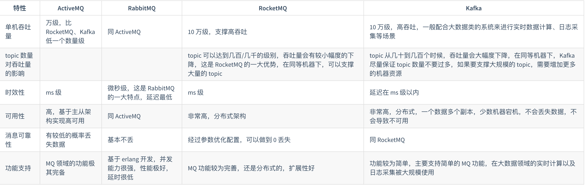

- [\# 为什么使用消息队列？](#-为什么使用消息队列)
- [\# Kafka、ActiveMQ、RabbitMQ、RocketMQ 都有什么区别，以及适合哪些场景？](#-kafkaactivemqrabbitmqrocketmq-都有什么区别以及适合哪些场景)
- [\# RabbitMQ 上的一个 queue 中存放的 message 是否有数量限制？](#-rabbitmq-上的一个-queue-中存放的-message-是否有数量限制)
- [\# Kafka 实现原理](#-kafka-实现原理)
- [\# partition和replica默认分配到哪个broker的策略?](#-partition和replica默认分配到哪个broker的策略)
- [\# 什么是kafka controller？](#-什么是kafka-controller)
- [\# Kafka 的选主机制？](#-kafka-的选主机制)
- [\# 选主算法比较？](#-选主算法比较)
- [\# ISR的机器都宕机的怎么办？](#-isr的机器都宕机的怎么办)
- [\# Kafka的ACK的值的含义？](#-kafka的ack的值的含义)
- [\# Kafka 为什么快？性能那么好？](#-kafka-为什么快性能那么好)
- [\# 什么是元数据？元数据分为哪些类型？包括哪些内容？与 cluster 相关的元数据有哪些？元数据是如何保存的？元数据在 cluster 中是如何分布的？](#-什么是元数据元数据分为哪些类型包括哪些内容与-cluster-相关的元数据有哪些元数据是如何保存的元数据在-cluster-中是如何分布的)

## \# 为什么使用消息队列？
解耦、异步、削峰

## \# Kafka、ActiveMQ、RabbitMQ、RocketMQ 都有什么区别，以及适合哪些场景？

## \# RabbitMQ 上的一个 queue 中存放的 message 是否有数量限制？
可以认为是无限制，因为限制取决于机器的内存，但是消息过多会导致处理效率的下降。

## \# Kafka 实现原理
Kafka 由多个 broker 组成，每个 broker 是一个节点；你创建一个 topic，这个 topic 可以划分为多个 partition，每个 partition 可以存在于不同的 broker 上，每个 partition 就放一部分数据。这就是天然的分布式消息队列，就是说一个 topic 的数据，是分散放在多个机器上的，每个机器就放一部分数据。
- 可用性：Kafka 提供了 HA 机制，就是 replica（复制品） 副本机制。每个 partition 的数据都会同步到其它机器上，形成自己的多个 replica 副本。所有 replica 会选举一个 leader 出来，那么生产和消费都跟这个 leader 打交道，然后其他 replica 就是 follower。写的时候，leader 会负责把数据同步到所有 follower 上去，读的时候就直接读 leader 上的数据即可。只能读写 leader？很简单，要是你可以随意读写每个 follower，那么就要 care 数据一致性的问题，系统复杂度太高，很容易出问题。Kafka 会均匀地将一个 partition 的所有 replica 分布在不同的机器上，这样才可以提高容错性。
- 可靠性：
  - 消费端弄丢数据：唯一可能导致消费者弄丢数据的情况，就是说，你消费到了这个消息，然后消费者那边自动提交了 offset，让 Kafka 以为你已经消费好了这个消息，但其实你才刚准备处理这个消息，你还没处理，你自己就挂了，此时这条消息就丢咯；关闭自动提交 offset，在处理完之后自己手动提交 offset，就可以保证数据不会丢。
  - Kafka 弄丢数据：Kafka 某个 broker 宕机，然后重新选举 partition 的 leader。大家想想，要是此时其他的 follower 刚好还有些数据没有同步，结果此时 leader 挂了，然后选举某个 follower 成 leader 之后，不就少了一些数据？这就丢了一些数据啊。要求每个 partition 必须有至少 2 个副本。要求一个 leader 至少感知到有至少一个 follower 还跟自己保持联系，没掉队，这样才能确保 leader 挂了还有一个 follower 吧。要求每条数据，必须是写入所有 replica 之后，才能认为是写成功了。要求一旦写入失败，就无限重试
  - 生产者弄丢数据：设置了 acks=all ，一定不会丢；
- 顺序性：生产者在写的时候，其实可以指定一个 key，比如说我们指定了某个订单 id 作为 key，那么这个订单相关的数据，一定会被分发到同一个 partition 中去，而且这个 partition 中的数据一定是有顺序的。消费者从 partition 中取出来数据的时候，也一定是有顺序的。

## \# partition和replica默认分配到哪个broker的策略?
1. 将所有N Broker和待分配的i个Partition排序.
2. 将第i个Partition分配到第(i mod n)个Broker上.
3. 将第i个Partition的第j个副本分配到第((i + j) mod n)个Broker上.

## \# 什么是kafka controller？
controller相当于整个kafka集群的master，负责topic的创建、删除、以及partition的状态机转换，broker的上线、下线等。
它是通过抢占方式在zookeeper上注册临时节点来实现的，第一个注册成功的即为controller。
由于zookeeper临时节点的有效性是通过session来判断的，若在session timeout时间内，controller所在的broker断掉，则会触发新的controller选举。

## \# Kafka 的选主机制？
ISR（In-Sync Replicas）
选leader一个基本的原则就是，如果Leader不在了，新的Leader必须拥有原来的Leader commit过的所有消息。ISR列表里的副本都跟上了leader，所以就是在这里边选一个。
副本会有单独的线程（ReplicaFetcherThread），去从leader上去拉去消息同步。当follower赶上leader，就会保持或加入到ISR列表里，就说明此follower满足上述最基本的原则（跟上leader进度）。ISR列表存在zookeeper上。

## \# 选主算法比较？
1. Majority Vote：如果我们有2f+1个Replica（包含Leader和Follower），那在commit之前必须保证有f+1个Replica复制完消息，为了保证正确选出新的Leader，fail的Replica不能超过f个。因为在剩下的任意f+1个Replica里，至少有一个Replica包含有最新的所有消息。
   - 优点：系统的潜力只取决于最快的几个Broker，而非最慢那个。
   - 劣势：同等数量的机器，它所能容忍的fail的follower个数比较少。比如：如果要容忍1个follower挂掉，必须要有3个以上的Replica，如果要容忍2个Follower挂掉，必须要有5个以上的Replica。
   - 结论：就是这种算法更多用在Zookeeper这种共享集群配置的系统中使用，而很少在需要存储大量数据的系统中使用的原因。
2. ISR：Kafka在Zookeeper中动态维护了一个ISR（in-sync replicas），这个ISR里的所有Replica都跟上了leader，只有ISR里的成员才有被选为Leader的可能。
   - 优点：在这种模式下，对于f+1个Replica，一个Partition能在保证不丢失已经commit的消息的前提下容忍f个Replica的失败。
   - 缺点：相应的，leader需要等待最慢的那个replica，但是Kafka作者认为Kafka可以通过Producer选择是否被commit阻塞来改善这一问题，trade-off就是节省下来的Replica和磁盘。

## \# ISR的机器都宕机的怎么办？
1. 等待ISR中的任一个Replica“活”过来，并且选它作为Leader；有可能要等很长时间
2. 选择第一个“活”过来的Replica（不一定是ISR中的）作为Leader；会丢消息，但是能很快响应

## \# Kafka的ACK的值的含义？
1. 0表示纯异步，不等待，写进socket buffer就继续。
2. 1表示leader写进server的本地log，就返回，不等待follower的回应。
3. -1相当于all，表示等待follower回应再继续发消息。保证了ISR列表里至少有一个replica，数据就不会丢失，最高的保证级别。

## \# Kafka 为什么快？性能那么好？
1. 顺序写入：Kafka 中每个分区是一个有序的，不可变的消息序列，新的消息不断追加到 Partition 的末尾，在 Kafka 中 Partition 只是一个逻辑概念，Kafka 将 Partition 划分为多个 Segment，每个 Segment 对应一个物理文件，Kafka 对 segment 文件追加写，这就是顺序写文件。
2. 零拷贝：传统磁盘IO(4次Copy，读取磁盘文件到操作系统内核缓冲区->将内核缓冲区的数据，copy 到应用程序的 buffer->将应用程序 buffer 中的数据，copy 到 socket 网络发送缓冲区->将 socket buffer 的数据，copy 到网卡，由网卡进行网络传输)；Kafka 使用到了 mmap和 sendfile的方式来实现零拷贝。
3. 批量操作与压缩：Kafka Producer 向 Broker 发送消息不是一条消息一条消息的发送。Producer 有两个重要的参数：batch.size和linger.ms。这两个参数就和 Producer 的批量发送有关。
4. 分区并发：Kafka 的 Topic 可以分成多个 Partition，每个 Paritition 类似于一个队列，保证数据有序。同一个 Group 下的不同 Consumer 并发消费 Paritition，分区实际上是调优 Kafka 并行度的最小单元，因此，可以说，每增加一个 Paritition 就增加了一个消费并发。
5. 网络模型：基于 Java NIO

## \# 什么是元数据？元数据分为哪些类型？包括哪些内容？与 cluster 相关的元数据有哪些？元数据是如何保存的？元数据在 cluster 中是如何分布的？
1. 非 cluster 模式下，元数据主要分为
   1. Queue 元数据（queue 名字和属性等）
   2. Exchange元数据（exchange 名字、类型和属性等）
   3. Binding 元数据（存放路由关系的查找表）
   4. Vhost元数据（vhost 范围内针对前三者的名字空间约束和安全属性设置
2. cluster 模式下，还包括 cluster 中 node 位置信息和 node 关系信息。
3. 元数据按照 erlang node 的类型确定是仅保存于 RAM 中，还是同时保存在 RAM 和 disk 上。元数据在 cluster 中是全 node 分布的。